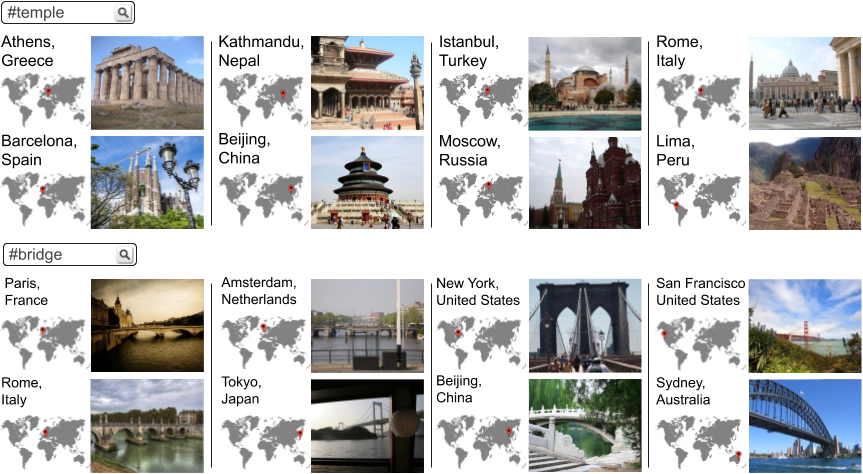
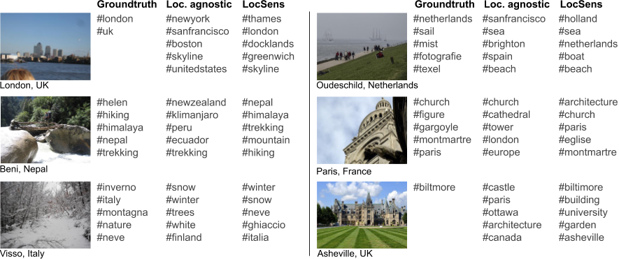

# Code of Location Sensitive Image Retrieval and Tagging

**ECCV 2020**  
**Raul Gomez, Jaume Gibert, Lluis Gomez and Dimosthenis Karatzas**    

[Paper](https://arxiv.org/abs/2007.03375)  
[Blog Post](https://gombru.github.io/2020/06/03/LocSens/)

**This code needs intense cleaning and simplification that will be done as soon as possible**

## Results Examples

LocSens is able to retrieve images related to a query word and near to a given location:  

LocSens is able to tag images exploiting both visual and location information of an image, outperforming location agnostic tagging methods:  

## Code explanation

Here we explain roughly how this first version of the code works. Each script includes a short explanation of what it does.

### dataset_code
Contains the code to generate the hashtag vocabulary, the splits and the query sets. It works over the YFCC100M dataset, which is available [here](https://multimediacommons.wordpress.com/yfcc100m-core-dataset/).

### splits
Contains the exact splits we used in our paper.

### MCC, MLC, HER
Contain the code to train this models as explained in the paper chapter "Learning with Hashtag Supervision." 

### LocSens
Contains the code to train LocSens.

### evaluation
Contains the code to evaluate both the location agnostic models and LocSens. The code the compute the embeddings used in this evaluations scripts is located in each of the models folders.

